```graphviz
digraph G {
N0 [label="0: Use(UNumber)"];
N1 [label="1: Use(UList { items: Use(0), min_len: 0, max_len: None })"];
N2 [label="2: Value(VNumber)"];
N3 [label="3: Value(VFunc { pattern: Use(1), ret: Value(2) })"];
N4 [label="4: Use(UNumber)"];
N5 [label="5: Use(UList { items: Use(4), min_len: 0, max_len: None })"];
N6 [label="6: Value(VNumber)"];
N7 [label="7: Value(VFunc { pattern: Use(5), ret: Value(6) })"];
N8 [label="8: Use(UNumber)"];
N9 [label="9: Use(UNumber)"];
N10 [label="10: Use(UTuple { items: [Use(8), Use(9)] })"];
N11 [label="11: Value(VBool)"];
N12 [label="12: Value(VFunc { pattern: Use(10), ret: Value(11) })"];
N13 [label="13: Value(VTuple { items: [] })"];
N14 [label="14: Value(VTuple { items: [] })"];
N15 [label="15: Value(VBool)"];
N16 [label="16: Use(UBool)"];
N17 [label="17: Value(VNumber)"];
N18 [label="18: Value(VNumber)"];
N19 [label="19: Var"];
START -> N19
N1 -> N0 [color=red, style=dotted];
N3 -> N1 [color=blue, style=dotted];
N3 -> N2 [color=blue, style=dotted];
N5 -> N4 [color=red, style=dotted];
N7 -> N5 [color=blue, style=dotted];
N7 -> N6 [color=blue, style=dotted];
N10 -> N8 [color=red, style=dotted];
N10 -> N9 [color=red, style=dotted];
N12 -> N10 [color=blue, style=dotted];
N12 -> N11 [color=blue, style=dotted];
N15 -> N16;
N17 -> N19;
N18 -> N19;
}

```

I have a basic type inference.

However, there is problem with printing strings.


```
(let :x (if true 5 3))

x
```

```type
Number
```



```graphviz
digraph G {
N0 [label="0: Use(UNumber)"];
N1 [label="1: Use(UList { items: Use(0), min_len: 0, max_len: None })"];
N2 [label="2: Value(VNumber)"];
N3 [label="3: Value(VFunc { pattern: Use(1), ret: Value(2) })"];
N4 [label="4: Use(UNumber)"];
N5 [label="5: Use(UList { items: Use(4), min_len: 0, max_len: None })"];
N6 [label="6: Value(VNumber)"];
N7 [label="7: Value(VFunc { pattern: Use(5), ret: Value(6) })"];
N8 [label="8: Use(UNumber)"];
N9 [label="9: Use(UNumber)"];
N10 [label="10: Use(UTuple { items: [Use(8), Use(9)] })"];
N11 [label="11: Value(VBool)"];
N12 [label="12: Value(VFunc { pattern: Use(10), ret: Value(11) })"];
N13 [label="13: Value(VTuple { items: [] })"];
N14 [label="14: Value(VBool)"];
N15 [label="15: Use(UBool)"];
N16 [label="16: Value(VNumber)"];
N17 [label="17: Value(VNumber)"];
N18 [label="18: Var"];
START -> N18
N1 -> N0 [color=red, style=dotted];
N3 -> N1 [color=blue, style=dotted];
N3 -> N2 [color=blue, style=dotted];
N5 -> N4 [color=red, style=dotted];
N7 -> N5 [color=blue, style=dotted];
N7 -> N6 [color=blue, style=dotted];
N10 -> N8 [color=red, style=dotted];
N10 -> N9 [color=red, style=dotted];
N12 -> N10 [color=blue, style=dotted];
N12 -> N11 [color=blue, style=dotted];
N14 -> N15;
N16 -> N18;
N17 -> N18;
}

```

This returns `Number | Number` because we are not deduplicating the node from edges...

Just printing on the fly is not enough, we need to traverse the graph, collect all possible nodes and then deduplicate them.

Okay, i added type node deduplication.
Question is if its correct:

```
(let :x (if true 5 5))
(let :y (if false "string" "string"))

x
```

```type
Number
```

