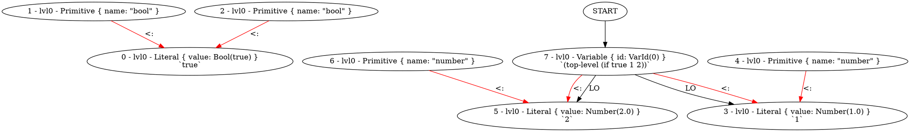

Rembember how we had to deal with unique values when printing types?

Well... We "solved" it by making sure only one value is added to the graph.
But that worked only when we did not take spans into account.

VTypeHead must be unique per span.
But at the same time when we print we must somehow distil the fact,
that

```
let x = 1
and y = 2
```
that x and y have the same type.

Additionally in the future it might be useful to have a way to for example "find all references" of given type.

Ok. So i added "type definition" to the core.
Its another node in the graph, and type values can point
to it.

```
(if true 1 2)
```

```type
1 ∨ 2
```



```
4
```

```type
4
```

```
(let :x (if true 5))

x
```

```type
5 ∨ ()
```

```
(fn (:x) x)
```

```type
('a) → 'a
```

```
(fn (:x :y) (
    if x y
))
```

```type
(bool, 'a) → ()
```
