New day new problem :D

```
(let (:a (:b :c) :d) (list 1 (list 2 3) 4))

b
```

```type
Number
```

here the issue is, we use `list` to construct both tuple with 3
and 2 elements.
And our tuple is not polymorphic (yet).

Does it work with single usage of a `list`?

```
(let :x (list 1 2 3))
x
```

```type
(Number, Number, Number)
```

and two uses

```
(let :x (list 1 2 3))
(let :y (list 3 2))

x
```

```type
(Number, Number, Number)
```

what?

```
(let :x (list 1 (list 2 3) 4))
x
```


```type
(Number, (Number, Number), Number)
```


Huh

```graphviz
digraph G {
N0 [label="0: Def(Number)"];
N1 [label="1: Def(String)"];
N2 [label="2: Def(Bool)"];
N3 [label="3: Def(Keyword)"];
N4 [label="4: Def(Tuple([]))"];
N5 [label="5: Value(VList { items: [] })"];
N6 [label="6: Var"];
N7 [label="7: Var"];
N8 [label="8: Use(UList { items: Use(7), min_len: 0, max_len: None })"];
N9 [label="9: Value(VFunc { pattern: Use(6), ret: Value(6) })"];
N10 [label="10: Value(VNumber)"];
N11 [label="11: Var"];
N12 [label="12: Var"];
N13 [label="13: Use(UList { items: Use(12), min_len: 0, max_len: None })"];
N14 [label="14: Value(VFunc { pattern: Use(11), ret: Value(11) })"];
N15 [label="15: Value(VNumber)"];
N16 [label="16: Value(VNumber)"];
N17 [label="17: Var"];
N18 [label="18: Value(VList { items: [Value(15), Value(16)] })"];
N19 [label="19: Use(UFunc { args: Value(18), ret: Use(17) })"];
N20 [label="20: Value(VNumber)"];
N21 [label="21: Var"];
N22 [label="22: Value(VList { items: [Value(10), Value(17), Value(20)] })"];
N23 [label="23: Use(UFunc { args: Value(22), ret: Use(21) })"];
START -> N21
N8 -> N7 [color=red, style=dotted];
N9 -> N6 [color=blue, style=dotted];
N9 -> N6 [color=blue, style=dotted];
N13 -> N12 [color=red, style=dotted];
N14 -> N11 [color=blue, style=dotted];
N14 -> N11 [color=blue, style=dotted];
N18 -> N15 [color=blue, style=dotted];
N18 -> N16 [color=blue, style=dotted];
N19 -> N18 [color=red, style=dotted];
N19 -> N17 [color=red, style=dotted];
N22 -> N10 [color=blue, style=dotted];
N22 -> N17 [color=blue, style=dotted];
N22 -> N20 [color=blue, style=dotted];
N23 -> N22 [color=red, style=dotted];
N23 -> N21 [color=red, style=dotted];
N5 -> N4;
N6 -> N8;
N6 -> N21;
N9 -> N23;
N10 -> N0;
N10 -> N7;
N11 -> N13;
N11 -> N17;
N11 -> N7;
N14 -> N19;
N15 -> N0;
N15 -> N12;
N16 -> N0;
N16 -> N12;
N17 -> N7;
N18 -> N11;
N18 -> N17;
N18 -> N13;
N18 -> N7;
N20 -> N0;
N20 -> N7;
N22 -> N6;
N22 -> N21;
N22 -> N8;
}

```



Okay, "let polymorphism" worked.
I said "let" in quotes because its not really for let (yet).
Only `list` is polymorphic so far.

Okay, `let` become polymorphic but only in the case where there is no
destruction.
Which makes sense, because "let polymorphism" is used in a case of:

```
(let :f (fn (:x) x))
(f 1)
(f "a")

f
```

```type
(Any) -> Any
```

