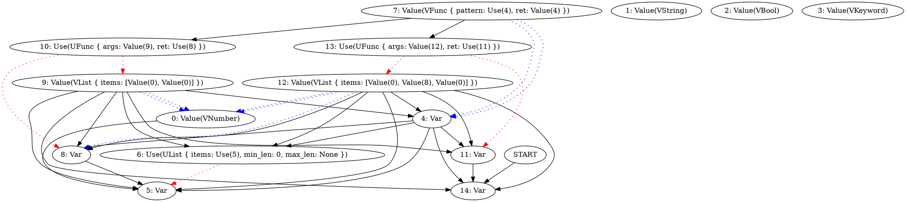

New day new problem :D

```
(let (:a (:b :c) :d) (list 1 (list 2 3) 4))

b
```

```type
ERROR: WrongNumberOfArguments(3, 2)
```

here the issue is, we use `list` to construct both tuple with 3
and 2 elements.
And our tuple is not polymorphic (yet).

Does it work with single usage of a `list`?

```
(let :x (list 1 2 3))
x
```

```type
(Number, Number, Number)
```

and two uses

```
(let :x (list 1 2 3))
(let :y (list 3 2))

x
```

```type
(Number, Number, Number) | (Number, Number)
```

what?

```
(let :x (list 1 (list 2 3) 4))
x
```


```type
(Number, (Number, Number) | (Number, <recursive>, Number), Number) | (Number, Number)
```


Huh


