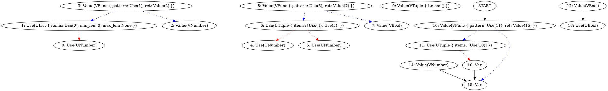

Okay, almost everything is fixed.
There is one problem:

When we have a polymorphic function, it does not print variables that are still
without a concrete type.

```
(let :f (fn (:x) (if true 1 x)))

f
```

```type
(Any) -> Any | Number
```




# Error messages

Before i continue it makes sense to finally tackle diagnostics.

Okay.

So for example

```
(if "foo" 1 2)
```

```type ignore
ERROR: IncompatibleTypes(VString, UBool, Span { range: Range { start_byte: 0, end_byte: 0, start_point: Point { row: 0, column: 0 }, end_point: Point { row: 0, column: 0 } }, filename: "", source: "" }, Span { range: Range { start_byte: 0, end_byte: 14, start_point: Point { row: 0, column: 0 }, end_point: Point { row: 0, column: 14 } }, filename: "<todo>", source: "(if \"foo\" 1 2)" })
```

Ugh... Almost :)