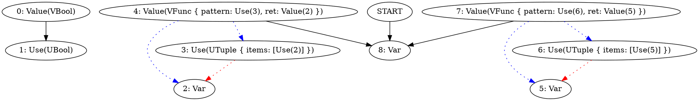
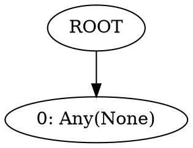

I'm not sure if type definition is a good idea.

It works for primitive types. But how should i handle function?

for example here:

```ignore
(fn (:x) x)
```

the type of a function should be `(Any) -> Any` or `(T0) -> T0`.
But that is infered during typechecking. So what is type definition here?

Also, consider this example:

```
(if true 
    (fn (:x) x)
    (fn (:y) y)
)
```

what should be the type? Can we say that type of `(fn (:x) x)` is the same as `(fn (:y) y)`?
Or can we only say that type of `(fn (:x) x)` is **EQUAL** to `(fn (:y) y)`?

The VTypeHead will be a separate node, because these two have different spans.
But then when we print the type, we probably want to show this:

```ignore
(Any) -> Any
```

instead of this

```ignore
(Any) -> Any | (Any) -> Any
```

So when printing the type we need to have "unique" type information.

Problem is, when we printed before introducing type definition, we were using both `VTypeHead` and `UTypeHead`
to create a final type string. 

So maybe type definition has to stay but it cannot be a part of the graph?
Maybe that is a runtime thing that our printer generates before actually printing the type?

We would convert a graph that contains of `Var|Value|Use` to a set of `Def`. A set that is unique.
And then print the set into a string.

What im trying to achieve is called canonicalization.

```type ignore
(Any) -> Any
```



Ok. Most works. The only thing not working is destructing for some reason.

Lets look at the simplest example:

```
(let :l (list 1 2 3))
l
```

```type
[Number]
```

Ok. this works...

```
(let (:a :b :c) (list 1 2 3))
a
```

```type
Number
```





```graphviz
digraph G {
N0 [label="0: Use(UNumber)"];
N1 [label="1: Use(UList { items: Use(0), min_len: 0, max_len: None })"];
N2 [label="2: Value(VNumber)"];
N3 [label="3: Value(VFunc { pattern: Use(1), ret: Value(2) })"];
N4 [label="4: Use(UNumber)"];
N5 [label="5: Use(UNumber)"];
N6 [label="6: Use(UTuple { items: [Use(4), Use(5)] })"];
N7 [label="7: Value(VBool)"];
N8 [label="8: Value(VFunc { pattern: Use(6), ret: Value(7) })"];
N9 [label="9: Var"];
N10 [label="10: Var"];
N11 [label="11: Var"];
N12 [label="12: Use(UTuple { items: [Use(9), Use(10), Use(11)] })"];
N13 [label="13: Var"];
N14 [label="14: Use(UList { items: Use(13), min_len: 0, max_len: None })"];
N15 [label="15: Value(VList { item: Value(13) })"];
N16 [label="16: Value(VFunc { pattern: Use(14), ret: Value(15) })"];
N17 [label="17: Value(VNumber)"];
N18 [label="18: Value(VNumber)"];
N19 [label="19: Value(VNumber)"];
N20 [label="20: Var"];
N21 [label="21: Value(VTuple { items: [Value(17), Value(18), Value(19)] })"];
N22 [label="22: Use(UFunc { args: Value(21), ret: Use(20) })"];
N23 [label="23: Value(VTuple { items: [] })"];
START -> N9
N1 -> N0 [color=red, style=dotted];
N3 -> N1 [color=blue, style=dotted];
N3 -> N2 [color=blue, style=dotted];
N6 -> N4 [color=red, style=dotted];
N6 -> N5 [color=red, style=dotted];
N8 -> N6 [color=blue, style=dotted];
N8 -> N7 [color=blue, style=dotted];
N12 -> N9 [color=red, style=dotted];
N12 -> N10 [color=red, style=dotted];
N12 -> N11 [color=red, style=dotted];
N14 -> N13 [color=red, style=dotted];
N15 -> N13 [color=blue, style=dotted];
N16 -> N14 [color=blue, style=dotted];
N16 -> N15 [color=blue, style=dotted];
N21 -> N17 [color=blue, style=dotted];
N21 -> N18 [color=blue, style=dotted];
N21 -> N19 [color=blue, style=dotted];
N22 -> N21 [color=red, style=dotted];
N22 -> N20 [color=red, style=dotted];
N13 -> N11;
N13 -> N10;
N13 -> N9;
N15 -> N20;
N15 -> N12;
N16 -> N22;
N17 -> N13;
N17 -> N11;
N17 -> N10;
N17 -> N9;
N18 -> N13;
N18 -> N11;
N18 -> N10;
N18 -> N9;
N19 -> N13;
N19 -> N11;
N19 -> N10;
N19 -> N9;
N20 -> N12;
N21 -> N14;
}

```

Quick sidequest, is the type inference here correct?

```
(let (:a :b) 4)
a
```

```type
Error: Incompatible types
   ╭─[ <input>:1:1 ]
   │
 1 │ (let (:a :b) 4)
   │        │     │   
   │        ╰───────── Expected tuple
   │              │   
   │              ╰─── But got number
───╯

```

That's better!

Holy shit that actually works!

But now i think there is one more thing.

Previously i said that let polymorphism works only for single pattern:

```
(let :f (fn (:x) x))
```

But that is not true if you think about it. What if we want to destruct a tuple that contains two functions?

```
(let (:f :g) (list
    (fn (:x) x)
    (fn (:y) y)
))
(f 3)
f
```

```type
(Number) -> Number
```

Okay, we fixed one small issue with canonical form, so now we can focus on polymorphism.

First of all. Should or should not this function be polymorphic here?

Well the answer is - it depends.
In OCaml and other languages there is a concept of "value restriction".

Values are things like literals (42, "hello"), lambda abstractions (fn x → …), tuples of values, records of values, and so on.

Non‑values include applications (f e), data‐structure constructors (e.g. list 1 2 3), or anything that might (in an impure core) allocate mutable cells or suspend computations.

and in our case `list` is technically a non-value, because it is a function call.
Even though we kinda guarantee that it does not allocate mutable references, have no side effects and basically is pure.

So technically if we could mark a function as "safe_for_generalization" then we could lift the restriction that tells that we cannot generalize an expression that calls that function.

However, for now it is safer to say "this is forbidden" and then lift the restriction in the future.

Who knows, maybe "safe_for_generalization" would be expressed by some kind of annotation or algebraic effect system.

So for now i will abandon let polymorphism for destructuring.

Okay then, what else i need to actually write in the type inference?

Fuck it, lets try to plug it into main runtime and see what blows :)

