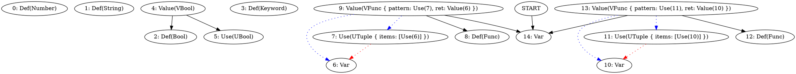

I'm not sure if type definition is a good idea.

It works for primitive types. But how should i handle function?

for example here:

```ignore
(fn (:x) x)
```

the type of a function should be `(Any) -> Any` or `(T0) -> T0`.
But that is infered during typechecking. So what is type definition here?

Also, consider this example:

```
(if true 
    (fn (:x) x)
    (fn (:y) y)
)
```

what should be the type? Can we say that type of `(fn (:x) x)` is the same as `(fn (:y) y)`?
Or can we only say that type of `(fn (:x) x)` is **EQUAL** to `(fn (:y) y)`?

The VTypeHead will be a separate node, because these two have different spans.
But then when we print the type, we probably want to show this:

```ignore
(Any) -> Any
```

instead of this

```ignore
(Any) -> Any | (Any) -> Any
```

So when printing the type we need to have "unique" type information.

Problem is, when we printed before introducing type definition, we were using both `VTypeHead` and `UTypeHead`
to create a final type string. 

So maybe type definition has to stay but it cannot be a part of the graph?
Maybe that is a runtime thing that our printer generates before actually printing the type?

We would convert a graph that contains of `Var|Value|Use` to a set of `Def`. A set that is unique.
And then print the set into a string.

What im trying to achieve is called canonicalization.

```type
function | function
```

